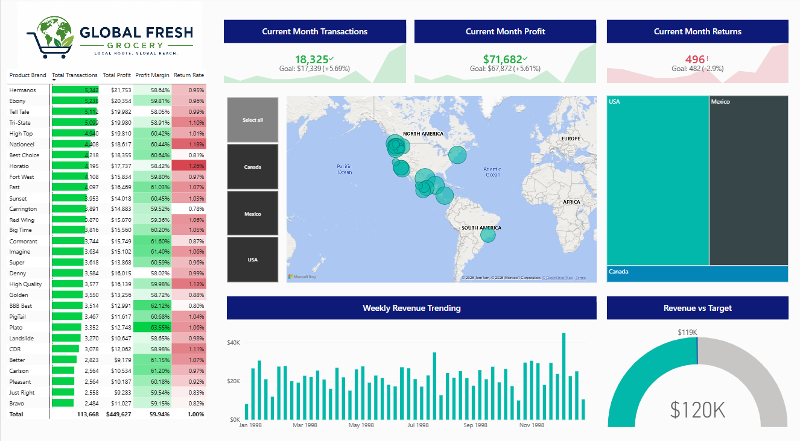

# Global Fresh Grocery Performance Dashboard

## Project Overview

Global Fresh is a simulated multinational grocery retailer operating across the United States, Canada, and Mexico. This Power BI dashboard was designed to help leadership monitor sales performance, profitability, product trends, and geographic performance across retail locations.

The project follows a complete business intelligence workflow: connecting and transforming raw data, designing a relational data model, creating DAX calculations, and developing an interactive executive dashboard.

## Business Objectives

The dashboard was built to help stakeholders answer key questions:

* Which product brands drive the highest transaction volume?
* How are revenue, profit, and returns trending over time?
* Which store locations and regions contribute most to performance?
* Are monthly sales meeting growth targets?
* Where are return rates impacting overall profitability?

## Tools & Skills Used

**Power BI**

* Data modeling
* Power Query transformations
* DAX calculations
* Interactive dashboard design
* KPI development
* Conditional formatting
* Geographic visualization

**Data Preparation**

* Imported and transformed multiple CSV data sources
* Cleaned and formatted customer, product, store, region, calendar, transaction, and return data
* Created calculated columns for customer segmentation, product tiers, date analysis, and store attributes
* Built a star schema data model with one-to-many relationships

## Data Model

Designed a relational model connecting:

* Transactions
* Returns
* Customers
* Products
* Stores
* Regions
* Calendar

Relationships were structured with single-direction filtering from lookup tables to fact tables to support accurate reporting and analysis.

## Key Measures Created

Built DAX measures including:

* Total Revenue
* Total Profit
* Profit Margin
* Total Transactions
* Return Rate
* Year-to-Date Revenue
* Rolling 60-Day Revenue
* Month-over-month comparisons
* Revenue targets

## Dashboard Features

* Executive KPI cards tracking monthly transactions, profit, and returns
* Product performance matrix with conditional formatting
* Geographic analysis by store location
* Country and region drill-down functionality
* Weekly revenue trend analysis
* Revenue vs. target tracking
* Interactive filtering for insight storytelling

## Outcome

The final dashboard provides an executive-level view of business performance, allowing users to quickly identify trends, compare locations, monitor profitability, and explore operational insights.
